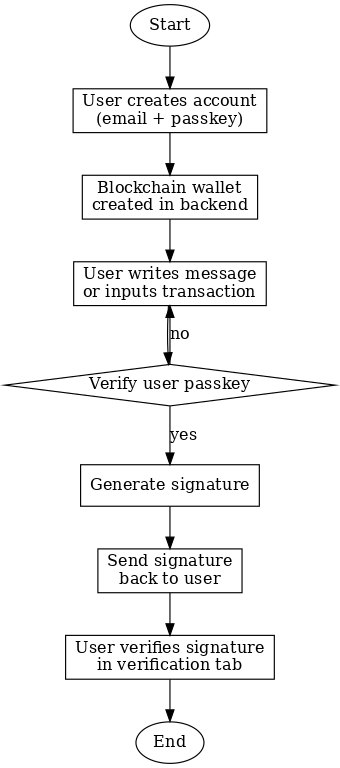

# Central Custody Blockchain Wallet Platform

## Tech Stack

- Frontend: Remix + React (TypeScript)
- Backend: NestJS (TypeScript) + Python 3
- Database: PostgreSQL (Support by Supabase)
- Cache DB: NestJS Cache DB
- Container: Docker
- On-Chain Data: Infura
- Cloud Providers:
  - Amazon Web Service (AWS)
  - Google Cloud (GCP)
  - Vercel
- CI / CD: GitHub Action
- Infra as Code (IaC): Terraform
- Error Tracking: Sentry (https://sentry.io/)

## Platform Flowchart



## ES256 JWT Signing Key Pair Generate

Generate the ECDSA key pairs with prime256v1 curve

```
openssl ecparam -name prime256v1 -genkey -noout -out private_key.pem
openssl ec -in private_key.pem -pubout -out public_key.pem
```

## Database AES Key Generate

```
head /dev/urandom | sha256sum
```

## Running the Frontend

```bash
cd Frontend

## Install the package
npm install

## Running on develop mode
npm run dev

## Only build the static files
npm run build

## Build and Run
npm run build && npm run start
```

## Build Backend Docker Image & Push to Cloud (On other Cloud Platforms)

```bash
## Build Docker Image
cd Backend
docker buildx build --platform linux/amd64 -t wallet-platform:latest .

## Push to Google Cloud
## Require: Docker, gcloud CLI
gcloud auth print-access-token | docker login -u oauth2accesstoken --password-stdin https://<LOCATION>-docker.pkg.dev
gcloud artifacts repositories create backend --repository-format=docker \
    --location=<LOCATION> --description="Backend Docker Image" \
    --project=<PROJECT_ID>
docker tag wallet-platform:latest <LOCATION>-docker.pkg.dev/<PROJECT_ID>/backend/wallet-platform:latest
docker push <LOCATION>-docker.pkg.dev/<PROJECT_ID>/backend/wallet-platform:latest

## Push to DigitalOcean
## Require: Docker, doctl CLI
docker tag wallet-platform registry.digitalocean.com/<ACCOUNT>/wallet-platform
docker push registry.digitalocean.com/<ACCOUNT>/wallet-platform
```
