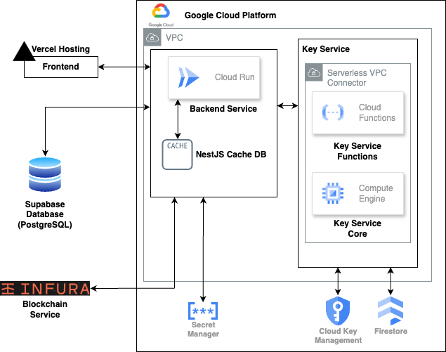

# Central Custody Blockchain Wallet Platform

## 1 Tech Stack

- Frontend: Remix + React (TypeScript)
- Backend: NestJS (TypeScript) + GoLang + Python 3
- Cache DB: NestJS Cache Manager
- Infra as Code (IaC)
  - Terraform
  - Bash Script
- Container as a Service (CaaS)
  - Docker
- Infrastructure as a Service (IaaS)
  - Cloud Provider
    - Amazon Web Service (AWS)
    - Google Cloud (GCP)
- Platform as a Service (PaaS)
  - Hosting
    - Vercel
- Backend as a Service (BaaS)
  - Database
    - Supabase (backed by PostgreSQL)
    - Google Cloud Firestore
- Blockchain Infrastructure as a Service (BIaaS)
  - Infura.io
- Software as a Service (SaaS)
  - DevOps
    - GitHub (Include the CI/CD tool - GitHub Action)
    - Sentry (for Error Tracking)

## 2 Wallet Platform Architecture Diagram

- Version A (Key Service in GCP - regular version)



- Version B (Key Service use AWS Nitro Enclave)

## 3 Platform Flowchart


## 4 ES256 JWT Signing Key Pair Generate

Generate the ECDSA key pairs with prime256v1 curve

```
openssl ecparam -name prime256v1 -genkey -noout -out private_key.pem
openssl ec -in private_key.pem -pubout -out public_key.pem
```

## 5 Database AES Key Generate

```
head /dev/urandom | sha256sum
```

## 6 Running the Frontend

```bash
cd Frontend

## Install the package
npm install

## Running on develop mode
npm run dev

## Only build the static files
npm run build

## Build and Run
npm run build && npm run start
```

## 7 Build Backend Docker Image & Push to Cloud (On other Cloud Platforms)

```bash
## Build Docker Image
cd Backend
docker buildx build --platform linux/amd64 -t wallet-platform:latest .

## Push to Google Cloud
## Require: Docker, gcloud CLI
gcloud auth print-access-token | docker login -u oauth2accesstoken --password-stdin https://<LOCATION>-docker.pkg.dev
gcloud artifacts repositories create backend --repository-format=docker \
    --location=<LOCATION> --description="Backend Docker Image" \
    --project=<PROJECT_ID>
docker tag wallet-platform:latest <LOCATION>-docker.pkg.dev/<PROJECT_ID>/backend/wallet-platform:latest
docker push <LOCATION>-docker.pkg.dev/<PROJECT_ID>/backend/wallet-platform:latest

## Push to DigitalOcean
## Require: Docker, doctl CLI
docker tag wallet-platform registry.digitalocean.com/<ACCOUNT>/wallet-platform
docker push registry.digitalocean.com/<ACCOUNT>/wallet-platform
```
