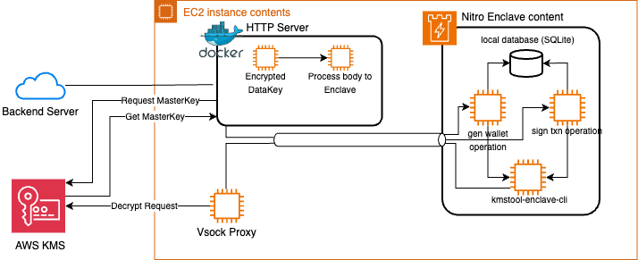

# Central Custody Blockchain Wallet Platform - Key Service

## Declaration

- This Blockchain Wallet Key Service was forked from GitHub Repo: [aws-nitro-enclave-blockchain-wallet](https://github.com/aws-samples/aws-nitro-enclave-blockchain-wallet), and based on this sample code to customize the code using on this platform
- The cloud archtecture of this services based on the AWS documents: [Part 1](https://aws.amazon.com/blogs/web3/aws-nitro-enclaves-for-secure-blockchain-key-management-part-1/), [Part 2](https://aws.amazon.com/blogs/web3/aws-nitro-enclaves-for-secure-blockchain-key-management-part-2/), [Part 3](https://aws.amazon.com/blogs/web3/aws-nitro-enclaves-for-secure-blockchain-key-management-part-3/).

## Tech Stack

- Programming Language: Python 3
- Container: Docker
- Script: Bash
- Infra
  - AWS
    - EC2 with Nitro Enclave
    - Lambda Function
    - Key Management Service

## Key Service Cloud Archtecture

